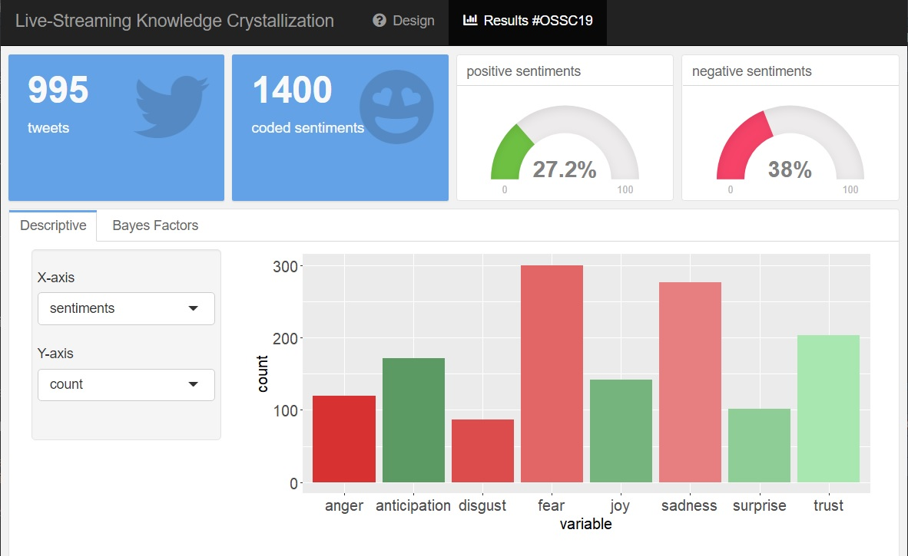

```{r setup, include=FALSE}
knitr::opts_chunk$set(echo = FALSE,
                      message=FALSE, 
                      warning=FALSE)
# download.file("https://drive.google.com/uc?export=download&id=1wuMqL_Z8T9rxuGvn0VP6siag90kHDm2O", 
#               "../www/references.bib", overwrite = T)
library(fontawesome)
library(tidyverse)
library(kableExtra)
library(rmarkdown)
```

## Bevor es losgeht

* Aufnahme ok?


## Agenda

1. Data Analysis
  - Regression
  - t-Test
  - ANOVA
  - CFA?
2. RMarkdown
  - 

# Data Analysis

## Data Analysis | Regression

Berechne eine Regression mit dem Datensatz `airquality`  
__Hypothese 1:__ _Je höher die Intensität der Sonneneinstralung `$Solar.R` desto höher ist die gemessene Temperatur `$Temp`._  
__Hypothese 2:__ _Der Zusammenhang zwischen der Sonneneinstralung und der Temperatur wird durch die Windstärke `$Wind` moderiert._

* verwende die Funktion `lm()`
* Schau dir die _Hilfe_ an, wie die Regression spezifiziert werden muss (z.B. in "Details" und "Examples")
* Ihr kommt nicht weiter? Schau auf [Quick-R](https://www.statmethods.net/stats/regression.html)

<div class="question">

1. Teste die Hypothesen und speichere das Ergebnis in einem Objekt.
2. Rufe das Objekt mit `summary()` auf.

<br />
`r fa(name = "question-circle")` Was lässt sich über die Hypothesen sagen?
<br />
`r fa(name = "question-circle")` Welche Teile des Outputs verstehst du, welche nicht?
<br /><br />
Langweilig? Versuche die Regression zu plotten.
</div>


## Data Analysis | t-Test

Berechne einen t-Test für unabhängige, dann abhängige Stichproben mit dem Datensatz `mtcars`  
__Hypothese 1:__ _Autos deren Zylinder V-förmig angerichtet sind `$vs`, brauchen auf eine 1/4-Meile weniger Zeit `$qsec` als Autos mit gerade ausgerichteten Zylindern `$vs`._  
__Hypothese 2:__ _Die Anzahl der Zylinder `$cyl` ist geringer als die Anzahl der Gänge `$gear`._

* verwende die Funktion `t.test()`
* Schau dir die _Hilfe_ an: Achtung, für eine Hypothese mus du das Argument "formula" verweden und für die andere "x" und "y"
* Ihr kommt nicht weiter? Schau auf [Quick-R](https://www.statmethods.net/stats/ttest.html)

<div class="question">

1. Teste die Hypothesen und speichere das Ergebnis in einem Objekt.
2. Rufe das Objekt mit `summary()` auf.

<br />
`r fa(name = "question-circle")` Was lässt sich über die Hypothesen sagen?
<br />
`r fa(name = "question-circle")` Welche Teile des Outputs verstehst du, welche nicht?
<br /><br />
Langweilig? Versuche die Daten zu den Hypothesen zu plotten.
</div>


## Data Analysis | ANOVA

Berechne eine ANOVA mit dem Datensatz `iris`  
__Hypothese 1:__ _Die Länge der Blütenblätter `$Petal.Length` unterscheidet sich zwischen den drei Blumenarten `$Species`_  
__Hypothese 2:__ _Die größten Unterschiede bestehen zwischen der Blume setosa und der Blume virginica._

* verwende die Funktion `aov()` und `TukeyHSD()`
* Schau dir die _Hilfe_ an, wie du die ANOVA spezifizieren musst und welches Objekt die Funktion `TukeyHSD()` benötigt.
* Ihr kommt nicht weiter? Schau auf [Quick-R](https://www.statmethods.net/stats/anova.html)

<div class="question">

1. Teste die Hypothesen und speichere das Ergebnis in einem Objekt.
2. Rufe das Objekt mit `summary()` auf.

<br />
`r fa(name = "question-circle")` Was lässt sich über die Hypothesen sagen?
<br />
`r fa(name = "question-circle")` Welche Teile des Outputs verstehst du, welche nicht?
<br /><br />
Langweilig? Versuche die Daten zu den Hypothesen zu plotten.
</div>

## Data Analysis | CFA

Installiere und lade das Paket {lavaan}. Berechne eine CFA mit dem Datensatz `https://shiny.jschn.org/www/cfa.csv`  

1. _Teste ein eindimensionales Modell (alle Items laden auf einen Faktor)._  
2. _Teste ein zweidimensionales Modell (item6 und item7 bilden einen eigenen Faktor)._

Schau dir das Beispiel auf der [vignette](https://lavaan.ugent.be/tutorial/cfa.html) an.

<div class="question">

Teste die Modelle:
<br />
`r fa(name = "question-circle")` Wo ist der Fit besser?
<br />
`r fa(name = "question-circle")` Kannst du die Modelle gegeneinander testen?
<br /><br />
Langweilig? Versuche das Modell anhand `semPaths()` aus dem Paket {semPlot} zu plotten.
</div>

# R & RMarkdown

## R & RMarkdown | `r fa(name = "rocket", fill = "#293133")` wohin geht's?

[Beispiel zu "Blogdown"](https://jschn.org/)  
<iframe src="https://jschn.org/" style="width: 100%; height: 480px;"></iframe>

## R & RMarkdown | `r fa(name = "rocket", fill = "#293133")` wohin geht's?
[Beispiel zu "Bookdown"](https://r4ds.had.co.nz/) 
<iframe src="https://r4ds.had.co.nz/" style="width: 100%; height: 480px;"></iframe>

## R & RMarkdown | `r fa(name = "rocket", fill = "#293133")` wohin geht's?
[Beispiel zu "Codebook"](https://rubenarslan.github.io/codebook/articles/codebook.html) 
<iframe src="https://rubenarslan.github.io/codebook/articles/codebook.html" style="width: 100%; height: 480px;"></iframe>

## R & RMarkdown | `r fa(name = "rocket", fill = "#293133")` wohin geht's?
Beispiel zu "Flexdashboard"  
{width=70%}

## R & RMarkdown | `r fa(name = "rocket", fill = "#293133")` wohin geht's?

jupyter Notebooks  
`r fa(name = "long-arrow-alt-right", fill = "#293133")` eine browserbasierte R-Version meines kompletten R-Projekts  
Beispiel [für Lehre](https://github.com/j-5chneider/qda-ss2020)

## R & RMarkdown | `r fa(name = "rocket", fill = "#293133")` wohin geht's?
Beispiel zu "RMarkdown ioslides"  

Diese Folien :)

## R & RMarkdown | `r fa(name = "rocket", fill = "#293133")` wohin geht's?
[Beispiel zu "Radix"](https://rstudio.github.io/distill/), einer RMarkdown Formatierung.   
<iframe src="https://rstudio.github.io/distill/" style="width: 100%; height: 480px;"></iframe>


# &nbsp;
__Images:__  
(in order of appearance)  
  
<span>Photo by <a href="https://unsplash.com/@thisisengineering?utm_source=unsplash&amp;utm_medium=referral&amp;utm_content=creditCopyText">ThisisEngineering RAEng</a> on <a href="https://unsplash.com/s/photos/formula?utm_source=unsplash&amp;utm_medium=referral&amp;utm_content=creditCopyText">Unsplash</a></span>  


</span>