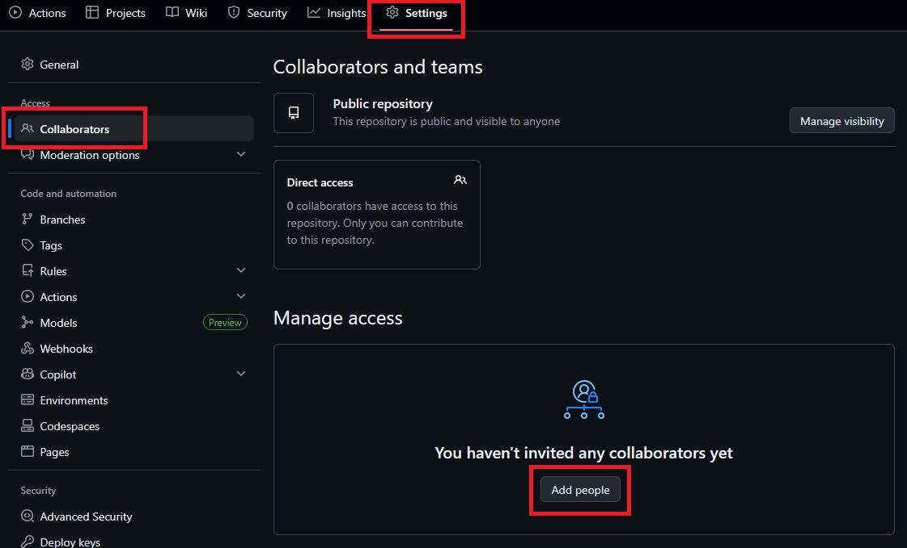
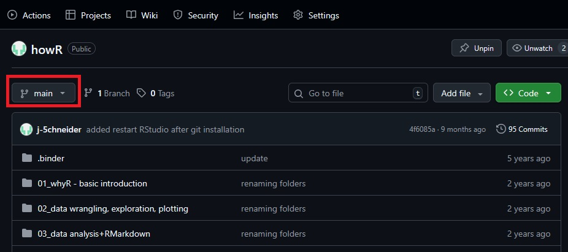
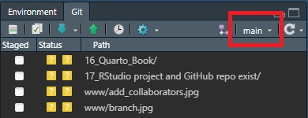

```{r}
#| echo: false
#| eval: true

library(fontawesome)
```

\

::: {style="background: #e8e9eb; border-radius: 10px; padding: 10px"}
**This is a guide** on how to connect an RStudio project with an existing GitHub repo.  
  
**You may have had to** copy your R project folders to a new machine or a colleague sent them to you per mail.  
  
And now you want to **reconnect the R project with the GitHub repo**.  

`r fa("registered", fill="#383e42", width="50px", margin_right="10px")` 
`r fa("left-right", fill="#383e42", width="50px", margin_right="10px")` 
`r fa("git-alt", fill="#383e42", width="50px", margin_right="10px")` 
`r fa("left-right", fill="#383e42", width="50px", margin_right="10px")` 
`r fa("github", fill="#383e42", width="50px")`
:::


\
\


# Connect to Git `r fa("registered", fill="#383e42", margin_right="10px")` `r fa("left-right", fill="#383e42", margin_right="10px")` `r fa("git-alt", fill="#383e42", margin_right="10px")`

You haven't **installed** [**Git**](https://git-scm.com/downloads) on your computer? Now is a good time. You don't need admin rights to do this. Restart RStudio after installing git!

Now we'll tell git who we are.  
Do this once for *each project*.  

## `usethis` package

The `usethis` package will help us a lot. Install it:

```{r}
install.packages("usethis")
```

## Let Git know who you are 

::: {.panel-tabset}

### Via `usethis`
```{r}
usethis::use_git_config(
  user.name = "Jane Doe", # <-- change to your name
  user.email = "jane@example.org", # <-- and your email
  init.defaultBranch = "main") # <-- not necessary but kinder than 'master'
```

### Alternative via terminal

Click on the `Terminal` tab (right next to the `Console` tab).  
Give your user name and email.

```{r}
git config user.name "Mona Lisa"
git config user.email "mona@lisa.org"
```

:::

## Initiate Git

If you haven't checked the box "Create a git repository", when creating the new project, run this code to start using Git.

```{r}
usethis::use_git()
```


\
\

# Connect to GitHub `r fa("registered", fill="#383e42", margin_right="10px")` `r fa("left-right", fill="#383e42", margin_right="10px")` `r fa("git-alt", fill="#383e42", margin_right="10px")` `r fa("left-right", fill="#383e42", margin_right="10px")` `r fa("github", fill="#383e42")`


## Do you have the rights to modify the GitHub repo?

* **Yes**, I am the **owner/creator** of the repo
* **Yes**, I was given the rights (e.g., by being included as a collaborator of the repo)
* **No**. I am not the owner/creator and wasn't included as a collaborator

**If No:** You won't have the rights to push (and thereby modify the repo). Ask the owner/creator to add you as a collaborator.  


  
## Verify that it is you (if needed)

**In case you haven't identified to github already:**

Not just anyone should be able to edit your repository, just you. So obviously you'll need to identify to GitHub. This is usually done by creating a *personal access token (PAT)*.  
  
### Create GitHub PAT
*You have used a PAT with RStudio on this machine before?*  
Then you probably don't need to do this step. Jump to the last step "Create GitHub repo".

```{r}
usethis::create_github_token(description = "Token for project ...") # <-- Fill in a name of your token
```

* Log into GitHub
* Set `expiration date` to `No expiration` (or a certain time frame if that's too insecure for you or there are more people using RStudio on this machine)
* Additionally check `write:packages`
* Create PAT
* Copy PAT and paste it somewhere for later use. *You cannot look it up in GitHub!*

### Now set this PAT in your RStudio
to make GitHub know: It is you who is using RStudio on this machine.

::: {.panel-tabset}
### Via `credentials`

I think the `credentials` package might already be installed, if not, run this:

```{r}
install.packages("credentials")
```

And now set the PAT, to identify yourself.

```{r}
credentials::set_github_pat() # <-- Token must *not* go into brackets, paste when asked in popup
```


### Via `gitcreds`

We'll need the package `gitcreds`. Install it:

```{r}
install.packages("gitcreds")
```

And now set the PAT, to identify yourself.

```{r}
gitcreds::gitcreds_set() # <-- Token must *not* go into brackets, paste when asked in popup
```
:::

\

## Initiate upstream tracking

Tell your local machine, that there is a GitHub repo you want to synchronize with.  
  
In the **terminal** (not console):


```{r}
git remote add origin https://github.com/j-5chneider/Eval_NRW.git
```

Substitute *https://github.com/j-5chneider/Eval_NRW.git* with the URL of your HitHib repo.

\

## Pull all files, allowing unrelated histories (conflicts)

Next we pull all files from the remote repo.  
  
In the **terminal** (not console):

```{r}
git pull origin main --allow-unrelated-histories
```

\

*In a ideal case, the local project and the remote repo on GitHub are already identical.*  
  
**If they are not identical**, the following command will pull all files from the repo to your local machine, documenting any *conflicts* within files. You will not lose any changes, if your local project is ahead of the remote repo, but the changes will be marked as conflicts. See [here on how to solve conflicts](https://stackoverflow.com/a/163659) or [follow along this video](https://www.youtube.com/watch?v=C_6LiLfyAh8).


\

## Rename local branch (if necessary)

Usually the local git branch will be named "master". This used to be convention in the past and still works fine today. However, in the last couple years, this branch was increasingly named "main". So this branch may either be called "main" or "master".  
  
What you'll need to make sure: **The names of the branch on your local R project and on the remote GitHub repo have to be the same.**  
  
Check on the **GitHub repo** website for the name of the branch:  
  
  
And check in your RStudio for the name of the branch:  

  
\

If they **don't match**, rename the local branch.  
In the **terminal** (not console):

```{r}
git branch -m master main 
```

Renaming from "master" to "main".

\

## Set github to track local changes

Lastly, you'll 

* push the local changes and solved conflicts (if there are any) to GitHub
* and make git **remember this connection for the future** (via `-u`)

In the **terminal** (not console):

```{r}
git push -u origin main
```

or using "master" (in case the GitHub branch is named like that)

```{r}
git push -u origin master
```