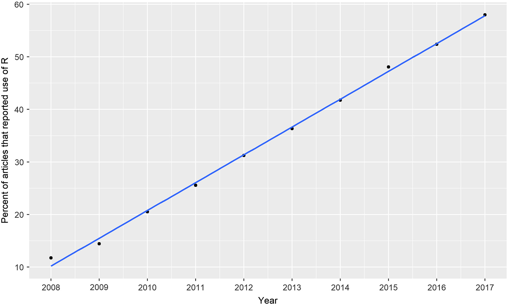
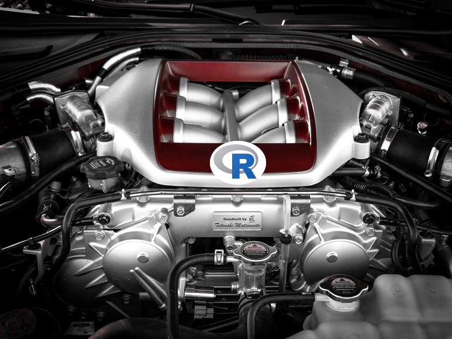
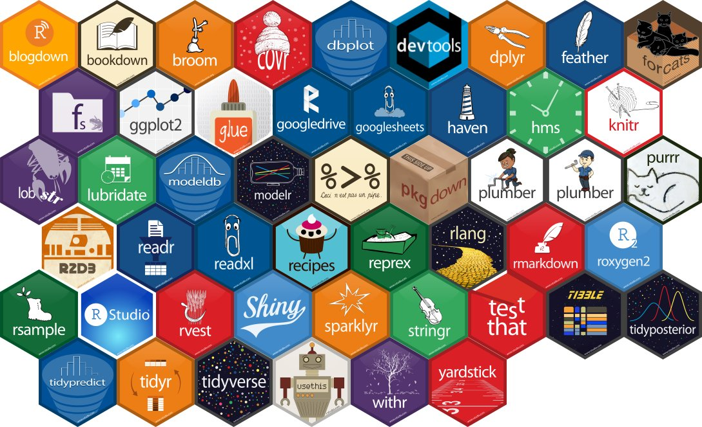
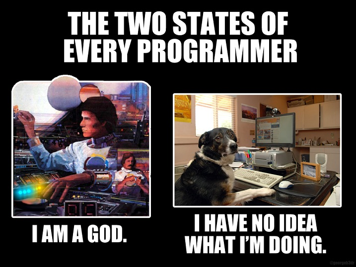

<style>
slides > slide:not(.nobackground):after {
  content: '';
}
</style>


```{r setup, include=FALSE}
knitr::opts_chunk$set(echo = FALSE,
                      message=FALSE, 
                      warning=FALSE)
# download.file("https://drive.google.com/uc?export=download&id=1wuMqL_Z8T9rxuGvn0VP6siag90kHDm2O", 
#               "../www/references.bib", overwrite = T)
library(fontawesome)
library(tidyverse)
library(kableExtra)
library(plotly)
library(rmarkdown)
library(countdown)
```

## Bevor es losgeht

* Folien herunterladen: [**bit.ly/howR2020**](http://bit.ly/howR2020) <br />`r fa(name = "folder")` *Ordner "1_whyR: basic introduction"*<br /> `r fa(name = "long-arrow-alt-right")` *Datei "1_hello_R.html"*
* RStudio starten 
* Aufnahme ok?

## Empfehlung

["R for Data Science"](https://r4ds.had.co.nz/)

<iframe src="https://r4ds.had.co.nz/" style="width: 100%; height: 500px;"></iframe>

## Agenda

1. Why R?
2. Überblick RStudio
3. Funktionsweise R
4. Helpseeking
5. Daten importieren & entdecken


## Spoiler


# Why R?


##
<iframe src="https://embed.polleverywhere.com/free_text_polls/0Ey8hyUDAa87594KSIMr1?controls=all&short_poll=true" width="100%" height="100%" frameBorder="0"></iframe>


## Why R? | because it's popular

<div class="popular"></div>
\
\
\
\


Job postings for  
Data Science Jobs on  
indeed.com (27. May 2019)  
<span class="mysource" style="float:left;">Bob Muenchen @ [R4stats](http://r4stats.com/2019/05/28/data-science-jobs-report-2019-python-way-up-tensorflow-growing-rapidly-r-use-double-sas/)</span>


## Why R? | because it's popular

Use of R in the field of ecology (2008-2017)  

{width=70%}<span class="mysource">[Lai et al. (2019)](https://doi.org/10.1002/ecs2.2567)</span>


## &nbsp; {.fullscreenac}

<span class="mysource">[Boudry (2019)](https://doi.org/10.7717/peerj.7850)&nbsp;&nbsp;&nbsp;&nbsp;&nbsp;</span>


## Why R? | because it's accessible

<a href="https://www.ibm.com/de-de/products/spss-statistics/pricing" target="_blank">__SPSS:__</a> 3 Jahre = 3.439,08€ (95,53€ / Monat) exklusive Steuern  
\

<a href="https://de.mathworks.com/store/products" target="_blank">__Matlab:__</a> zw. 500€ - 18.800€  
Statistics, Test, Measurement Packages = 2.900€


## Why R? | because it's accessible

R & RStudio steht unter der [GNU General Public License](https://www.gnu.org/licenses/gpl-3.0.de.html)

* Open Source
* kostenlos

<br />
`r fa(name = "hand-point-right")` jede Person kann Code ausführen

(also awesome: `r fa(name = "python")` Python)

## Why R? | Data wrangling & visualization

__Data wrangling:__ Prozess der Transformation von Rohdaten in "clean data"  

__Clean data:__ Daten liegen so vor, dass Analysen gerechnet werden können

* Tabellenformat anders strukturiert (z.B. aufgrund der Fragebogens)


## Why R? | Data wrangling & visualization

<div class="container">
<div class="box45l">
```{r}
data.frame(person_id = 1:5, measure_T1 = c(2,4,1,2,5), measure_T2 = c(4,6,4,3,6)) %>%
  kbl() %>%
  kable_paper("hover", full_width = F)
```
</div>
<div class="box45l">

</div>
</div>


## Why R? | Data wrangling & visualization

<div class="container">
<div class="box45l">
```{r}
data.frame(person_id = 1:5, measure_T1 = c(2,4,1,2,5), measure_T2 = c(4,6,4,3,6)) %>%
  kbl() %>%
  kable_paper("hover", full_width = F)
```
</div>
<div class="box45l">
```{r}
data.frame(person_id = c(1,1,2,2,3,3), pre_post = c("pre", "post", "pre", "post", "pre", "post"), measure = c(2,4,4,6,1,4)) %>%
  kbl() %>%
  kable_paper("hover", full_width = F)
```
</div>
</div>

## Why R? | Data wrangling & visualization

__Data wrangling:__ Prozess der Transformation von Rohdaten in "clean data"  

__Clean data:__ Daten liegen so vor, dass Analysen gerechnet werden können

* Tabellenformat anders strukturiert (z.B. aufgrund der Fragebogens)
* Datensätze matchen (Schüler- & Lehrerfragebogen)
* "messy data"


## Why R? | Data wrangling & visualization

```{r}
art_csv <- rio::import("../data/export-rayyan.csv")
art_csv <- art_csv %>%
    select(c(title,year,authors,notes))

art_csv %>%
  kbl() %>%
  kable_paper("hover")
```

## Why R? | Data wrangling & visualization

```{r}
art_csv %>%
  kbl() %>%
  kable_paper("hover")
```

<div style="position:absolute; top:0; left:70%">
{width=300px}
</div>

## Why R? | Data wrangling & visualization


```{r, echo = T}
art_csv <- art_csv %>%
  dplyr::mutate(excl_reason = str_extract(.$note, "RAYYAN-EXCLUSION-REASONS:.*?(\\||$)"),
                labels = str_extract(.$note, "RAYYAN-LABELS:.*?(\\||$)"),
                decision_j = str_extract(.$note, "juergen.schneider\"\"=>\"\".*?\"\""))%>% 
  dplyr::mutate(excl_reason = str_remove_all(excl_reason, "RAYYAN-EXCLUSION-REASONS:\\s"),
                labels = str_remove_all(labels, "RAYYAN-LABELS:\\s|\\s\\|"),
                decision_j = case_when(
                                str_detect(decision_j, "Excluded") ~ "Excluded",
                                str_detect(decision_j, "Included") ~ "Included",
                                str_detect(decision_j, "Maybe") ~ "Maybe")
                )
```

## Why R? | Data wrangling & visualization

\
\

```{r}
art_csv %>%
  select(-notes) %>%
  kbl() %>%
  kable_paper("hover")
```

## Why R? | Data wrangling & visualization

\
\

```{r}
art_csv %>%
  select(-notes) %>%
  kbl() %>%
  kable_paper("hover")
```

<div style="position:absolute; top:0; left:70%">
{width=250px}
</div>


## Why R? | Data wrangling & visualization

__Data wrangling:__ Prozess der Transformation von Rohdaten in "clean data"  

__Clean data:__ Daten liegen so vor, dass Analysen gerechnet werden können

* Tabellenformat anders strukturiert (z.B. aufgrund der Fragebogens)
* Datensätze matchen (Schüler- & Lehrerfragebogen)
* "messy data"
* Ausreißer, Definition fehlender Werte, ...


## Why R? | Data wrangling & visualization

```{r}

plot_ly(data = iris, x = ~Sepal.Length, y = ~Petal.Length, color = ~Species, colors = "Set1")
```

## Why R? | Data wrangling & visualization

```{r}
df <- read.csv("https://raw.githubusercontent.com/plotly/datasets/master/violin_data.csv")

fig <- df %>%
  plot_ly(
    x = ~day,
    y = ~total_bill,
    split = ~day,
    type = 'violin',
    box = list(
      visible = T
    ),
    meanline = list(
      visible = T
    )
  ) 

fig <- fig %>%
  layout(
    xaxis = list(
      title = "Day"
    ),
    yaxis = list(
      title = "Total Bill",
      zeroline = F
    )
  )

fig
```


## Why R? | Data wrangling & visualization

```{r, echo=T}
fig <- plot_ly(z = ~volcano)
fig %>% add_surface()
```


## Why R? | Reproducible Research


Alles in einer Datei:

* Daten (encodiert in Datei)
* Analysen (Skript dargestellt)
* Ergebnisse (mitsamt Tabellen & Abbildungen)
* Interpretation (Text)

Beispiel [hier klicken](https://gl.githack.com/j_5chneider/re-building-trust/-/raw/master/5_analyses/Reproducible-Documentation-of-Analyses.html)


# Aufbau von R & RStudio

## Überblick RStudio

<div class="container">
  <div class="box45l">
  __`r fa(name = "r-project")`__  
  {width=100%}
  </div>
  <div class="box45l">
  __RStudio__  
  {width=100%}
  </div>
</div>


## Überblick RStudio

Schaut euch das RStudio-Fenster an: 

* Welche Bereiche des Fensters kennt ihr? Was kann man "dort" machen?
* Welche Bereiche sagen euch nichts?

\
\

<div style="width: 30%; margin-left: auto; margin-right: auto; text-align:center;">__90 Sekunden Zeit!__</div>
```{r}
countdown(1.5, 
          play_sound = TRUE,
          color_border="#a41e51",
          color_background="#ce8f89",
          color_text = "#37414B",
          color_running_background = "#CE8F89",
          color_running_border = "#a41e51",
          color_running_text = "#ffffff",
          color_finished_background = "#a41e51",
          color_finished_text = "#ffffff",
          font_size = 4,
          style = "position: relative; width: 20%; margin-left: auto; margin-right: auto;")
```

## Überblick RStudio

__4 Fenster__

* Skriptfenster
* Konsole (& Terminal & R Markdown & Jobs)
* Environment (& History & Connections)
* Organisation

## Überblick RStudio | Konsole

__Hier wird gearbeitet:__

* Konsole
  - entspricht R (= übergibt Befehle an R)
  - Verarbeitet Eingaben (Befehle) in Ausgaben
  - `>` Eingabesymbol
  - `+` verknüpft Befehlszeilen
* Terminal
  - übergibt Befehle an Rechner
* R Markdown
  - Fortschritt der Kompilierung von R Markdown-Dateien
* Jobs
  - Aneinanderreihung von Befehlen i.S. einer Warteschlange
  - besonders nützlich bei Berechnungen, die lange dauern

## Überblick RStudio | Skriptfenster

* übersichtliche Auflistung von Befehlen
* kann an Konsole übergeben werden (`Strg + ↵` bzw. `CMD + ↵`)
* speichern, immer wieder ausführen, glücklich sein

## Überblick RStudio | Environment

* Environment: Auflistung der erstellten/geladenen Objekte
  - Name
  - Typ
  - Größe
  - ...
* History: Auflistung der ausgeführten Befehle

## Überblick RStudio | Organisation

* Überblick über den aktuellen Ordner ("working Directory")
  - R hat Probleme bei Installationen auf Rechnern dessen Benutzer/in einen Umlaut enthält
* Plot-Ausgabe
* Viewer (Ausgabe von PDFs, HTML, ...)
* Packages
* Help

## Funktionsweise | R + Packages

{width=65%}


## Funktionsweise | R + Packages
1. Benötigtes Paket installieren (Einmalig!)
    - Reiter "Packages" im Organisation-Fenster: "Install"
    - mit Code:

    ```{r, echo=T, eval=F}
    install.packages("tidyverse")
    ```

2. Benötigtes Paket laden (nach jedem Start!)
    - Reiter "Packages" im Organisation-Fenster: Häkchen setzen
    - mit Code:

    ```{r, echo=T, eval=F}
    library(tidyverse)
    ```

3. Funktion verwenden

    ```{r, echo=T, eval=F}
    cfa(model = mymodel,
        data = mydata)
    ```  


## Funktionsweise | R + Packages
<br />
`r fa(name = "hand-point-right")` R installiert Abhängigkeiten automatisch    
<br />
`r fa(name = "hand-point-right")` Oftmals gibt es mehrere Pakete für dasselbe Problem  
<br />
`r fa(name = "hand-point-right")` Welches ist das beste Paket? Ausprobieren/ etablierte Pakete verwenden

## Funktionsweise | R + Packages (Fehlermeldungen)

```{r, echo=T, eval=F}
cfa(model = mymodel,
    data = mydata)
```

<span style="color:red">
Error in cfa(model = mymodel, data = mydata) :  
could not find function "cfa"
</span>  
`r fa(name = "hand-point-right")` Paket laden
\
\

```{r, echo=T, eval=F}
library(lavaan)
```

<span style="color:red">Error in library(lavaan) : there is no package called ‘lavaan’</span>  
`r fa(name = "hand-point-right")` Paket installieren


## Funktionsweise | R als objektorientierte Programmiersprache
<br /><br /><br />
`r fa(name = "quote-left")` Alles, was existiert, ist ein __Objekt__. Alles, was passiert, ist ein **Funktions**aufruf. `r fa(name = "quote-right")`   
([Chambers, 2014](https://arxiv.org/abs/1409.3531))

## Funktionsweise | R als objektorientierte Programmiersprache

__Objekte__  
<br />
`r fa(name = "hand-point-right")` speichern Zustände oder Methoden (also eigentlich fast alles)  
<br />
`r fa(name = "hand-point-right")` Zuweisung erfolgt durch `<-` oder `=`  
<br />
`r fa(name = "hand-point-right")` Objektname frei wählbar

- nicht mit Zahl beginnen
- keine Leerzeichen
- keine Sonderzeichen


```{r, echo=T, eval=F}
das_ist_ein_Objekt <- 10
```


## Funktionsweise | R als objektorientierte Programmiersprache

__Objekttypen__  
<div class="container">
<div class="box45l" style="text-align:left;">

* numeric `as.numeric()`
  - integer `as.integer()`
  - double `as.double()`
* character `as.character()`
* factor `as.factor()`

\

* data.frame `data.frame()`
* vector `c()` & `as.vector()`
* list `list()`
* ...

</div>

<div class="box45l" style="text-align:left;">
```{r, echo=T, eval=F}
integer.Objekt <- as.integer(10)
double.Objekt <- as.double(6.2352)
```
\

```{r, echo=T, eval=F}
character.Objekt <- "Hier steht 1 Text"
character.Objekt <- as.character("Hier steht 1 Text")
```

</div>
</div>

## Funktionsweise | R als objektorientierte Programmiersprache
__Funktionen__  
`r fa(name = "hand-point-right")` in Paketen gespeichert  

```{r, echo=T, eval=F}
results_ttest <- t.test()
```


__Argumente__
```{r, echo=T, eval=F}
results_ttest <- t.test(x = ...,
                        y = ...,
                        paired = ...)
```


__Input-Werte__
```{r, echo=T, eval=F}
results_ttest <- t.test(x = iris$Sepal.Width,
                        y = iris$Petal.Width,
                        paired = TRUE)
```

## Funktionsweise | R als objektorientierte Programmiersprache

__Kommentare__
```{r, echo=T, eval=T}
# t-Test mit Datensatz Iris, der in base-R integriert ist
results_ttest <- t.test(x = iris$Sepal.Width,  # Kelchblatt Breite
                        y = iris$Petal.Width,  # Blütenblatt Breite
                        paired = TRUE)         # abhängige Stichprobe: ja
```


__Objekte aufrufen__
```{r, echo=T, eval=T}
results_ttest
```

## Funktionsweise | R als objektorientierte Programmiersprache

__Elemente aus Objekt aufrufen: per Index__
```{r, echo=T, eval=T}
mein_vektor <- c("A", "B", "C", "D")
mein_vektor

mein_vektor[2]
```

## Funktionsweise | R als objektorientierte Programmiersprache

__Elemente aus data.frame Objekt aufrufen: per Index__
```{r, echo=T, eval=T}
mein_df <- data.frame(treatment = c("EG", "EG", "KG", "KG"),
                      motivation = c(5,6,2,1))
mein_df
```

## Funktionsweise | R als objektorientierte Programmiersprache

__Elemente aus data.frame Objekt aufrufen: per Index__
```{r, echo=T, eval=T}
mein_df <- data.frame(treatment = c("EG", "EG", "KG", "KG"),
                      motivation = c(5,6,2,1))
mein_df
```

<div class="container">
  <div class="box30">
```{r, echo=T, eval=T}
mein_df[2]
```
  </div>
  <div class="box30">
```{r, echo=T, eval=T}
mein_df[,2]
```
  </div>
  <div class="box30">
```{r, echo=T, eval=T}
mein_df["motivation"]
```
  </div>
</div>


## Funktionsweise | R als objektorientierte Programmiersprache

__Elemente aus data.frame Objekt aufrufen: per $__
```{r, echo=T, eval=T}
mein_df
```

<div class="container">
  <div class="box30">
```{r, echo=T, eval=T}
mein_df$motivation
```
  </div>
  <div class="box30">
```{r, echo=T, eval=T}
mein_df$motivation[2]
```
  </div>
</div>


# Helpseeking

## Helpseeking

{width=70%}

## Helpseeking | Quellen

* R-Hilfe (*Welche* Argumente muss ich nochmal *wie* spezifizieren?)
* Vignetten der Pakete/ Funktionen (Komplexere Funktionen: Wie setze ich diese Funktion ein?)
* `r fa(name = "stack-overflow")` stackoverflow.com (Fehlermeldungen/ spezifisches Vorhaben)
* Cheatsheets (für *sehr* populäre Pakete)
* [Quick-R](https://www.statmethods.net/r-tutorial/index.html) und [datascience+](https://datascienceplus.com/) (grundsätzliche Funktionen)
* google (Welche Funktionen gibt es für den Import von SPSS Dateien?)

<br />
`r fa(name = "hand-point-right")` Zeitlimit setzen! `r fa(name = "long-arrow-alt-right")` Bei Kolleg*innen Hilfe holen! (R-Task-Force in Teams?)

## Helpseeking | R-Hilfe

* Jede (!) Funktion hat eine Hilfe
* Struktur ist immer
  - "Description": Was macht die Funktion?
  - "Usage": Welche Argumente hat die Funktion und was sind ihre default-Werte?
  - "Arguments": Was kann ich für die Argumente eingeben & wie muss ich es eingeben?
  - "Details": Wichtige Detailklärungen (meist für die Argumente)
  - "Value": Was wird ausgegeben, wenn die Funktion ausgeführt wird?
  - ...
  - "Examples": Die Funktion in action.
  
## Helpseeking | R-Hilfe

* Jede (!) Funktion hat eine Hilfe
* Struktur ist immer
  - "Description": Was macht die Funktion?
  - "Usage": Welche Argumente hat die Funktion und was sind ihre default-Werte?
  - "Arguments": Was kann ich für die Argumente eingeben & wie muss ich es eingeben?
  - "Details": Wichtige Detailklärungen (meist für die Argumente)
  - "Value": Was wird ausgegeben, wenn die Funktion ausgeführt wird?
  - ...
  - "Examples": Die Funktion in action

__Hilfe aufrufen:__  
```{r, echo=T, eval=F}
?cor.test()
```
(oder `F1`-Taste, wenn Cursor in Funktion)

## Helpseeking | Vignetten

* je nach Funktion/ Paket gibt es ausführliche Fallbeispiele
* normalerweise nur bei komplexeren Funktionen

ein paar Beispiele:  

* [{lavaan}](https://lavaan.ugent.be/tutorial/index.html) (Strukturgleichungsmodelle)
* [{bain}](https://cran.r-project.org/web/packages/bain/vignettes/Introduction_to_bain.html) (approximate adjusted fractional Bayes factors)
* [{ggplot2}](https://ggplot2.tidyverse.org/reference/index.html) (populäres Grafikpaket)
* [{plotly}](https://plotly.com/r/) (interaktive Grafiken)

__Vignetten finden:__  
google: "r vignette [Name des Pakets/ der Funktion]"

## Helpseeking | `r fa(name = "stack-overflow")` stackoverflow.com

"Dieses Problem hatte sicher schon einmal jemand!"  

__Beispiel:__  
google: "r sort columns of a data.frame by column name"
\
\
\

"Fehlermeldung für mich nicht verständlich"  
`r fa(name = "long-arrow-alt-right")` Fehler mit `"` in google eingeben  
`r fa(name = "long-arrow-alt-right")` nach stackoverflow-Treffern durchsuchen

## Helpseeking | Cheatsheets

Übersichtlich zusammengefasste Infos zu Paketen/ Methoden.
\
\

Die meisten Cheatsheets sind [hier](https://rstudio.com/resources/cheatsheets/) zu finden.

## Helpseeking | google

{width=45%}


# Let's do this

## Daten importieren

```{r, echo=T, eval=F}
# name.des.Objekts <- ???(argument1 = ???,
#                         ...)
```

* Funktionen:
  - `import()` aus **{rio} **
  - `read_csv()` aus **{readr}**
  - andere Funktionen/ Pakete? (z.B. aus [Quick-R](https://www.statmethods.net/input/importingdata.html) oder googlen)
* Pfad zu den Daten: https://shiny.jschn.org/www/fueleconomy.csv

\
\

<div class="question">
Zu zweit jeweils eine Import-Funktion ausprobieren:  
<br />
`r fa(name = "question-circle")` Welche Argumente müsst ihr angeben?  
<br />
`r fa(name = "question-circle")` Bonuspunkte für Funktionen, die nicht aus **{rio} ** oder **{readr}** sind

</div>

## Daten entdecken | Daten betrachten

Bedeutung der Variablen: `?mpg` (hierzu muss __{tidyverse}__ installiert sein)

* Daten anschauen, Funktionen: `View()`, `glimpse()`, `head()`, `tail()`, (weitere??)

<div class="question">
Verwendet die drei Funktionen, um den Datensatz zu betrachten.  
<br />
`r fa(name = "question-circle")` Welche Unterschiede im Output?  
<br />
`r fa(name = "question-circle")` Wofür würdet ihr die Funktionen in Zukunft verwenden?
</div>


## Daten entdecken | Daten explorieren

* Daten explorieren, Funktionen: `summary()`, `describeBy()`, (weitere??)
* Häufigkeitsverteilung: `table(Datensatz$Spalte)`
* Kreuztabellen: `table(Datensatz$Spalte1, Datensatz$Spalte2)`

<div class="question">
Verwendet die Funktionen, um den Datensatz zu explorieren.  
<br />
`r fa(name = "question-circle")` Wie oft gibt es welche Hersteller (manufacturer)?  
<br />
`r fa(name = "question-circle")` Welche Hersteller (manufacturer) haben kein Auto mit Vierradantrieb (drv)?  
<br />
`r fa(name = "question-circle")` Wie ist der durchschnittliche Benzinverbrauch auf dem Highway je nach Zylinderanzahl?  
<br />
`r fa(name = "question-circle")` Was ist der maximale, was der minimale Benzinverbrauch in der Stadt?
</div>

# &nbsp;
__Images:__  
(in order of appearance)  
  
<span style="font-size:.7em;">
https://i.imgflip.com/2fv0dh.jpg  
https://twitter.com/ProgrammersMeme/status/1308756251657072641  
https://i.imgflip.com/cnudu.jpg  
https://github.com/mitchelloharawild/hexwall  
<span>Photo by <a href="https://unsplash.com/@cafre77?utm_source=unsplash&amp;utm_medium=referral&amp;utm_content=creditCopyText">Carlos Freire</a> on <a href="https://unsplash.com/s/photos/car-engine?utm_source=unsplash&amp;utm_medium=referral&amp;utm_content=creditCopyText">Unsplash</a></span>  
<span>Photo by <a href="https://unsplash.com/@arteum?utm_source=unsplash&amp;utm_medium=referral&amp;utm_content=creditCopyText">Arteum.ro</a> on <a href="https://unsplash.com/s/photos/car-dashboard?utm_source=unsplash&amp;utm_medium=referral&amp;utm_content=creditCopyText">Unsplash</a></span>  
https://www.reddit.com/r/ProgrammerHumor/comments/f8duna/the_two_states_of_every_programmer/  
https://twitter.com/programmersmeme/status/1243850868082053121  

</span>